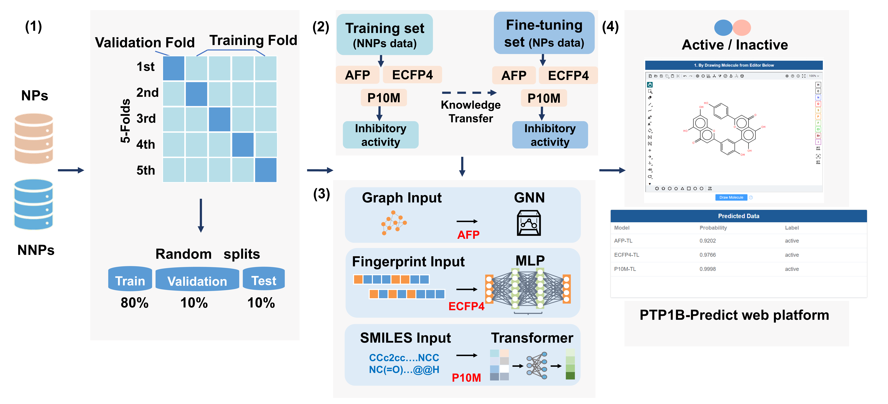
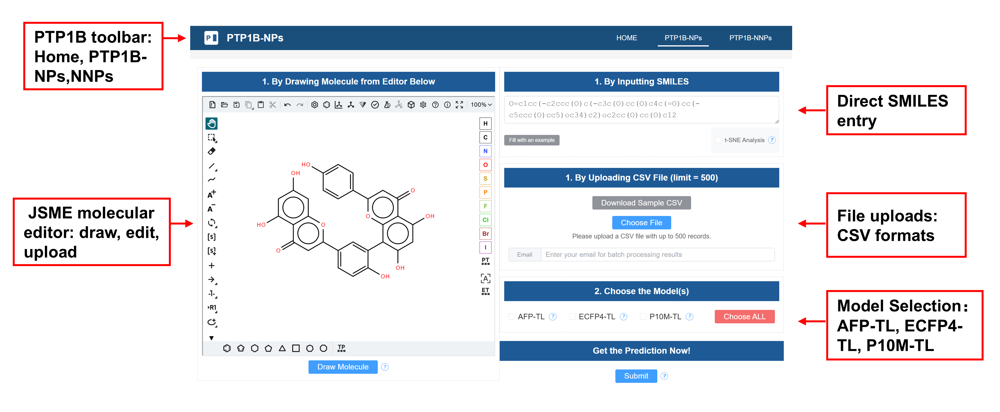

# A Transfer Learning Framework for PTP1B Inhibitor Activity Prediction

This repository contains our implementation of [A Transfer Learning Framework for PTP1B Inhibitor Activity Prediction: Differential Modeling of Natural and Non-Natural Products with Web Platform Implementation](https://doi.org/10.1007/s11030-025-11400-6). 

If you find this project useful, please cite our paper:

Wang ZX, Sun LL, Anqi Ren, Fang Yang, Chang Yu. A Transfer Learning Framework for PTP1B Inhibitor Activity Prediction: Differential Modeling of Natural and Non-Natural Products with Web Platform Implementation. Molecular Diversity. 2025
# Core Concepts

Copilot said: This project provides a flexible framework for
This project provides a flexible framework for building predictive models of PTP1B inhibitors, leveraging molecular fingerprints, molecular graphs, or SMILES as input features. The framework supports various deep learning architectures—including MLPs, AFP, and transformers—for modeling both natural and non-natural inhibitor datasets. Additionally, users can implement transfer learning between datasets as needed (for example, pretraining on non-natural inhibitors and fine-tuning on natural product data) based on this framework.

# Data Collection

The data used for model training and evaluation are sourced from the [ChEMBL](https://www.ebi.ac.uk/chembl/) database. The database provides detailed information on chemical structures, biological activities, and associated targets. It offers a wealth of data on the interactions between small molecules and biological targets such as proteins, enzymes, and receptors. This information is crucial for understanding the mechanism of action of drugs and for developing new therapeutic agents. In the application scenario of this project, you can collect inhibitor data for target targets in the CHEMBL database. This will include compound IDs, SMILES, activity data, test methods, etc. The PTP1B inhibitors collected from [ChEMBL](https://www.ebi.ac.uk/chembl/) need to be further classified into natural products and non-natural products.

In addition, in order to enrich the compounds in the negative dataset, you can adopt a certain sampling method to extract a certain number of compounds from the [ZINC](https://zinc.docking.org/) and [ChEMbl_NPs](https://www.ebi.ac.uk/chembl/)  datasets. Specific data collection and processing methods can be referred to in our published paper.

# Normalization

Deep learning models usually require a unified data input format to process molecular data. SMILES provides a standardized string representation, making it convenient for models to read and process a large amount of compound data. In this section, you need to further standardize the SMILES obtained from the [ChEMBL](https://www.ebi.ac.uk/chembl/) and [ZINC](https://zinc.docking.org/) database.

To preprocess you datasets please run `Normalization.ipynb`.

It using the [MolVS](https://molvs.readthedocs.io/en/latest/index.html) tool, which included structure normalization, salt removal, charge neutralization, and duplicate molecule elimination. 

# Model Training and Evaluation Based on AFP

The model is a GNN model built upon the [AFP](https://github.com/OpenDrugAI/AttentiveFP).

To train and evaluate your model useing AFP, please go to `AFP` directory and run `AFP.ipynb`

# Model Training and Evaluation Based on ECFP4-MLP

This model is an MLP that uses molecular fingerprint ECFP4 as input features.

To train and evaluate your model useing ECFP4-MLP, please go to `ECFP4-MLP` directory and run `ECFP4-MLP.ipynb`

# Model Training and Evaluation Based on P10M

The P10M model uses the self-supervised pretrained model [PubChem10M_SMILES_BPE_450k](https://huggingface.co/seyonec/PubChem10M_SMILES_BPE_450k) as a feature extractor, and further processes its output for molecular activity prediction.

To train and evaluate your model useing ECFP4-MLP, please go to `P10M` directory and run `P10M.ipynb`

# Transfer learning

Transfer learning can effectively improve the models' predictive performance on natural products. First, a base model is trained from scratch on the non-natural product dataset; then, the pretrained model serves as the starting point for further fine-tuning and optimization on the natural product dataset.

# PTP1B-Predict web platform

In addition, we have upgraded the [PTP1B-Predict web platform](http://ptp1bpredict.top) for direct prediction of the PTP1B inhibitory activity of your compounds.

